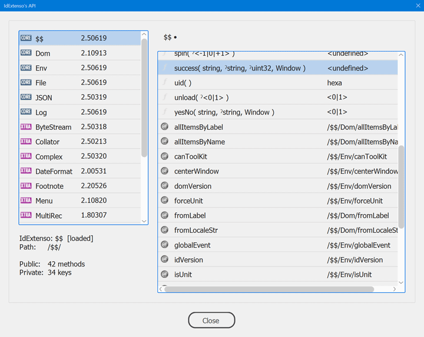

# *IdExtenso*  1.81117

*ExtendScript Framework for InDesign Ninjas.*

### Overview

***IdExtenso*** is a work-in-progress API dedicated to ExtendScript developers looking for a robust solution in the particular field of InDesign scripting. Think of it as a toolbox based on efficient and growing building blocks.

Do you need a clean JSON formatter that *really* supports ExtendScript oddities and InDesign DOM objects? Would you like to trace your debug messages in a log file the easy way? And always making sure that the environment (operating system, InDesign version, locale, script engine) is properly addressed? ***IdExtenso*** natively provides these features as they are parts of its core structure.

The framework is designed to support ExtendScript from version `3.92` to `4.5` and InDesign from `v.6.0` (CS4) to `14.x` (CC2019) in both Mac OS and Windows platforms. It fixes, improves or extends a number of built-in functionalities. For example, `myString.toSource()` can save 30% of the original result length, `$.global.parseInt()` complies with ECMAScript's latest specification, `RegExp.prototype["=="]` is implemented so that you can compare regexes using `==`, and so much more.

### What *IdExtenso* Is Not

***IdExtenso*** deals with ExtendScript and wants to make InDesign easier to automate as a primary goal. It does not offer a bunch of _JS sugars_ easily findable in other distributions. So it does not pretend to form a *library* in the narrow sense. It is about building a complete workspace. It wouldn't make sense to use it in small projects that don't involve features like localization, performance testing, user interface, modularity, compatibility, settings management.

### Key Points

- As fast and optimized as we can.

- Light-weight and maintaining the `[[global]]` scope as clean as possible.

- Smart support of persistent engines created via the `#targetengine` directive.

- Still works fine in a `JSXBIN` export of your final project.

- Fixes various compatibility issues regarding ExtendScript and/or InDesign DOM versions.

- Offers a growing number of extra modules that you can plug at wish through `#include`. Among the available modules present in the `/etc` branch, give a look at: **[Yalt](/etc/$$.Yalt.jsxlib)** (localization engine), **[Web](/etc/$$.Web.jsxlib)** (HTTP getter), **[Settings](/etc/$$.Settings.jsxlib)** (multiscope settings manager), **[MD5](/etc/$$.MD5.jsxlib)**, **[DateFormat](/etc/$$.DateFormat.jsxlib)**, **[ByteStream](/etc/$$.ByteStream.jsxlib)**, **[Unit](/etc/$$.Unit.jsxlib)**, etc.

### Getting Started

> *Warning*. — Use a true EDI ([SublimeText](https://www.sublimetext.com), [UltraEdit](http://www.ultraedit.com), etc.) rather than “ExtendScript ToolKit”. ESTK is not suitable for ***IdExtenso***.

1. Download the latest distribution ([ZIP file](https://github.com/indiscripts/IdExtenso/archive/master.zip)) and unzip the whole structure at a location available to the `Scripts Panel` folder. You must have at least `$$.jsxinc` (the _“entry point”_) and the `/core` subfolder. The `/etc` folder is optional but it contains modules of great value so I recommend you to keep it at hand.

2. Either create a sample script (e.g. `myTest.jsx`) or simply open one of those provided in [`/tests`](tests). 

3. The script must contain a directive `#include 'path/to/$$.jsxinc'` (which includes the framework.) A global reference `$$` is then available from which you can access any point of the API.

> *Note*. — If InDesign is not involved in your project, you may `#include` the alternate entry point [`$$.estk.jsxinc`]($$.estk.jsxinc) which is intended to make **IdExtenso** available in the ESTK context.

4. If relevant, include any additional module(s) you may need—e.g. `#include etc/Web.jsxlib`—so that `$$.Web` will be added too. (All methods and properties are documented in their respective module.)

5. After your `#include` directives, *DO NOT FORGET* to invoke `$$.load()`.

Congratulations! You're now ready to use ***IdExtenso*** in your script!

> *Tip*. — Use `$$.help()` at any point of your code to discover and browse the API of the included modules (including core features.) 

### Quick Example

This basic snippet illustrates how to use some core modules, namely **Log**, **JSON**, and **File**. Use it as a template to familiarize yourself with the framework.

    #target 'indesign'

    // IdExtenso entry point.
    // ---
    #include 'path/to/$$.jsxinc'

    // ---
    // Additional includes are possible here.
    // e.g: #include 'path/to/etc/Yalt.jsxlib'
    // ---

    // Load the framework.
    // ---
    $$.load('TRACE');

    // Your script goes here.
    // ======================
    try
    {
	    $$.Log.chrono().trace("Processing some huge JSON task...");
	    var json = $$.JSON(app.properties.activeDocument,1);

	    $$.Log.trace(__("JSON done in %1 ms.",+$$.Log.chrono));
	
	    alert( "The result should show up in a temporary file..." );
	    $$.File.temp(json,'tmp',1/*SHOW*/);
    }
    catch(e)
    {
	    $$.receiveError(e);
    }
    // ======================

    // Unload the framework.
    // ---
    $$.unload();

> _Note._ — The global identifier `$$` refers to ***IdExtenso***'s root API. You can reach all public features—including those available in the installed modules—from that identifier. For example, use `$$.File.writeUTF8()` to invoke the `writeUTF8` method of the **File** module.

Other [ready-to-use scripts](tests) are available in the `/tests` directory.
