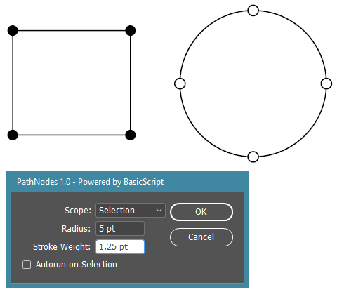
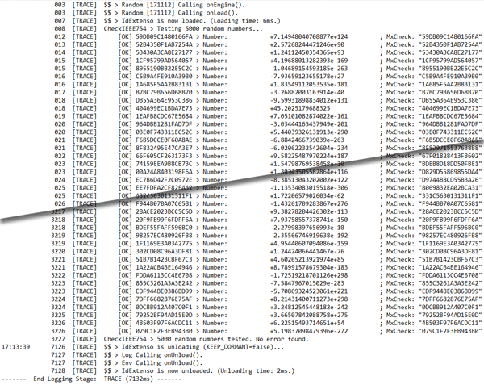
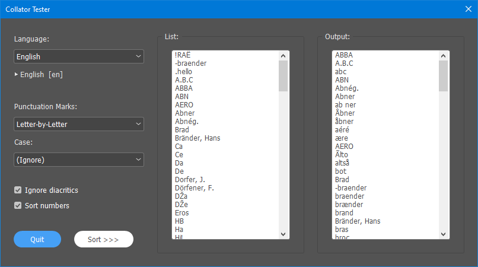
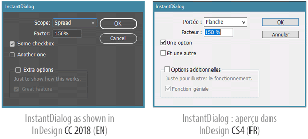
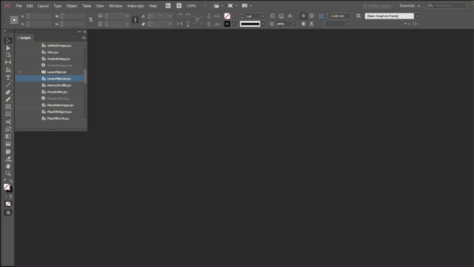
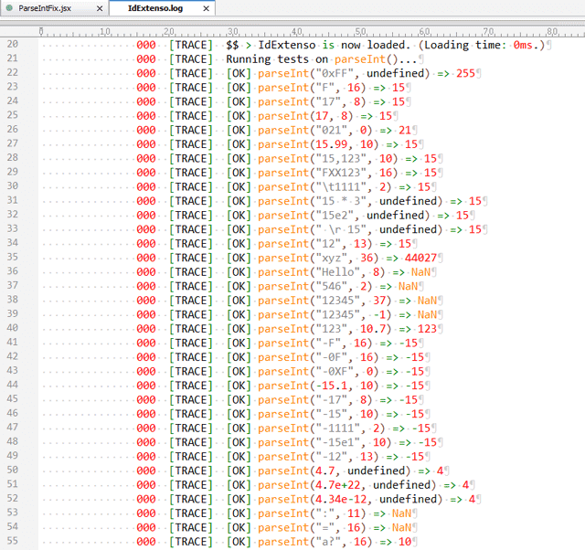
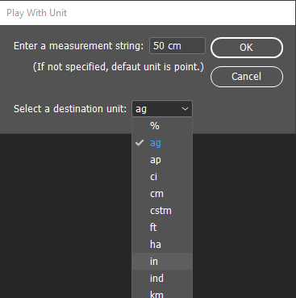
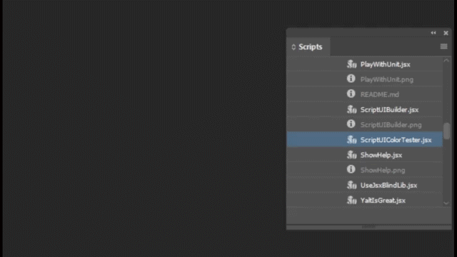
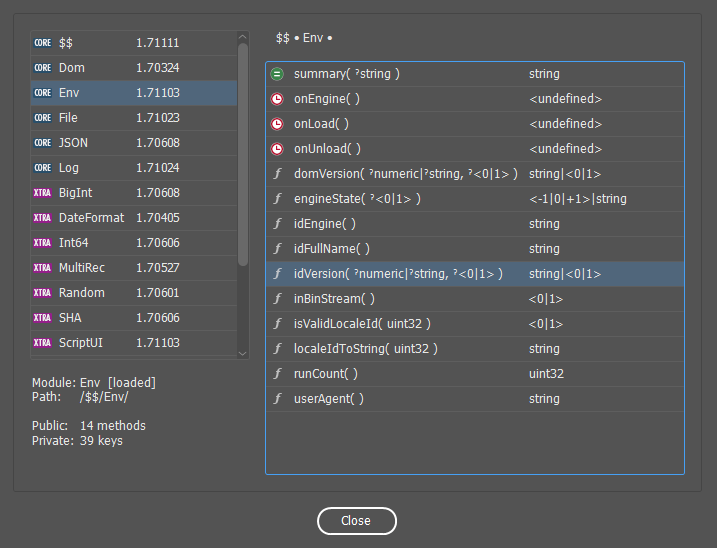

## Samples, Snippets, and HowTos

### Notice

The `/tests` subdir is not part of ***IdExtenso***'s core distribution. It just provides basic examples and case studies for newcomers.

From this location, any `.jsx` script can include the core framework using `#include '../$$.jsxinc`, which is simple enough to get started. Also, extra modules—which always belong to `/etc`—are selectively added using `#include '../etc/<ModuleName>.jsxlib` (provided the core is included *before*.)

### List of Testable Scripts

##### [`AppToJson.jsx`](AppToJson.jsx)

Stringify the entire contents of `app.properties`.

_Demonstrates:_
   
* `$$.JSON.lave()` routine (just calling `$$.JSON()`, as this is the `auto` method.)
* Some nice options behind it (verbose vs. compact format…)
* `$$.File.temp()` to output the result in a temp file (and open it.)

---

##### [`BasicScriptDemo.jsx`](BasicScriptDemo.jsx)

Manage a complete InDesign script (*PathNodes*) that creates custom circles at each path point of target item(s).

_Demonstrates:_
   
* Usage of **BasicScript** module (settings, localization, UI).
* Providing a **Yalt** package in four languages (`EN` + `FR` `DE` `ES`.)
* **Settings** keys with various lifespans (`RESET`, `SESSION`, `APP`.)

---

##### [`CheckIEEE754.jsx`](CheckIEEE754.jsx)

Perform tests on `Number.fromIEEE754()` and `Number.prototype.toIEEE754()` functions. This script generates 10,000 random numbers in IEEE754 64bit format and check whether the dedicated routines properly handle them. We used it to benchmark and validate the implementation of `fromIEEE754()` and `toIEEE754()`. Cool thing is, the script double-checks each conversion throughout the `TransformationMatrix` object, which provides a hidden way to encode a Number instance into IEEE754 form. See the code for details.

_Demonstrates:_
   
* Using `Number.fromIEEE754(hex)` and `Number.prototype.toIEEE754()`
* Getting IEEE754 representation from `TransformationMatrix`'s name property (personal hack.)
* Using the `Random` class to generate random numbers.

---

##### [`CollatorTester.jsx`](CollatorTester.jsx)

Experiment IdExtenso's ***Collator*** module in various languages.

_Demonstrates:_
   
* Using the `Collator` module.
* Adding a custom ***YALT*** package (`EN` + `FR` `DE` `ES` `IT` `RU`.)
* Simple modal dialog interface generated by `ScriptUI.builder`.

---

##### [`EnvSummary.jsx`](EnvSummary.jsx) vs. [`EnvSummary.bin.jsx`](EnvSummary.bin.jsx)

Report scripting context from the Env module.

_Demonstrates:_
   
* Usage of `$$.Env.domVersion()`, alias: `$$.domVersion()`
* Usage of `$$.Env.summary()`, alias: `$$.Env()`
* Main script and Running code status (JSX vs. JSXBIN), see `EnvSummary.bin.jsx` for additional information.
* Log in TRACE mode.

---

##### [`GetWebImage.jsx`](GetWebImage.jsx)

Download a PNG through `http` and load it in a ScriptUI dialog.   
_The user can now click the image to open the URL in the navigator!_

_Demonstrates:_
   
* `$$.Web(url)`, shortcut of `$$.Web.get(url)`.
* Using `toSource()` with binary strings is more compact w/ IdExtenso.
* Tracing steps thru `$$.trace()`, and more details on Log levels.
* [190322] Use ScriptUI.builder(); call `$$.Web.browse()` on click.

---

##### [`InstantDialog.jsx`](InstantDialog.jsx)

InDesign DOM dialog fast, easy, and with automatic localization.

_Demonstrates:_
   
* Usage of `$$.Dom.Dialog.fromXML()`.
* Displaying the dialog and having strings localized through **Yalt**.
* Access to UI values using `Dialog.setValueKey()` and `Dialog.getValueKey()` (augmented prototype.)
* Using `$$.isBooting()` to prepend persistent data (makes sense when a `#targetengine` directive is in use.)

---

##### [`LevenFilterList.jsx`](LevenFilterList.jsx)

Dynamic listbox filter based on [Levenshteim distance](https://en.wikipedia.org/wiki/Levenshtein_distance).

_Demonstrates:_
   
* Using `String.levenFilter()`.
* Using `ScriptUI.builder()` with event handlers.

---

##### [`MarkovShuffle.jsx`](MarkovShuffle.jsx)

Text scrambler based on Markov chains.

_Demonstrates:_
   
* Using the **Markov** module for the purpose of scrambling texts in InDesign.
* Including the **Random** module (to improve random functions.)

Cf. [Full article and demo](http://www.indiscripts.com/post/2018/01/how-to-shuffle-characters-the-right-way)

---

##### [`ParseIntFix.jsx`](ParseIntFix.jsx)

Run some tests on `$.global.parseInt` once patched by IdExtenso. (More detail [here](http://indiscripts.com/post/2019/01/how-to-get-parseint-fixed-in-extendscript).)

_Demonstrates:_
   
* Fixing a native ExtendScript bug in the `[[global]]` scope.
* Using `$$.trace`.

---

##### [`PlaceWebImage.jsx`](PlaceWebImage.jsx)

Download an image through `http` and place it in the active spread. (This script is a variant of GetWebImage.)

_Demonstrates:_
   
* `$$.Web(url)`, shortcut of `$$.Web.get(url)`.
* Using `$$.Web.parseURI` to identify the parts of an URL.
* Using `$$.File.temp` to create a temporary file.

---

##### [`PlayWithBigInt.jsx`](PlayWithBigInt.jsx)

Compute (arbitrary-precision) _big integers_ using the **BigInt** module.

_Demonstrates:_
   
* Including an optional module (from `/etc`.)
* Various ways of declaring `BigInt` instances.
* Using operators: `==`, `<`, `<=`, `+`, `-`, `*`, `/`, `%`, `<<`, `>>`, `~`, `&`, `|`, `^`.
* Divide-and-Remainder method, primality.
* Finding a huge prime number.

---

##### [`PlayWithUnit.jsx`](PlayWithUnit.jsx)

Use a consistent facade for handling metrical units.

_Demonstrates:_
   
* Optional module inclusion.
* Usage of `$$.Dom.Dialog()`.
* Basic internationalization (decimal point, etc.)
* Experimenting the Unit API: `info()`, `parse()`, `convertNumber()`, `format()`.

---

##### [`RegexFromCodeRanges.jsx`](RegexFromCodeRanges.jsx)

A useful static routine available in the `RegExp` object.

_Demonstrates:_
   
* Converting a set of code ranges into a RegExp pattern.
* Limitations (surrogate pairs must be consistent, i.e share the same base.)
* Producing a regex that captures misc. symbols and pictographs (from U+1F300 to U+1F5FF).

---

##### [`ScriptUIBuilder.jsx`](ScriptUIBuilder.jsx)

Build a powerful ScriptUI interface with no effort.

_Demonstrates:_
   
* Using the static `ScriptUI.builder()` function.
* Example of a 'resource object' with various widgets.
* Implementing a custom component thru a 'factory.'

---

##### [`ScriptUIColorTester.jsx`](ScriptUIColorTester.jsx)

Test the ScriptUI/colors snippet.

_Demonstrates:_
   
* Creation of random background colors.
* Color assignment via `0xRRGGBB` (hex) or `X|Y` descriptors (normal and disabled state.)
* Retrieving a color descriptor from `ScriptUI.colorGetter`.
* Usage of `ScriptUI.builder()` with color keys.

---

##### [`ShowHelp.jsx`](ShowHelp.jsx)

Get help on core and included modules.

_Demonstrates:_
   
* `$$.help()`; this method scans all present modules and displays the resulting API in a modal dialog.

---

##### [`UseJsxBlindLib.jsx`](UseJsxBlindLib.jsx)

Scramble a jsxbin file choosen by the user.

_Demonstrates:_
   
* Including and invoking the new ***JsxBlindLib*** library from any script project.

---

##### [`YaltIsGreat.jsx`](YaltIsGreat.jsx)

Basic features of the localization module (**Yalt**.)

_Demonstrates:_
   
* Including an optional module (from `/etc`.)
* Adding a localization package of your own.
* Using the `__()` function with a Yalt string.
* Activating another locale.
* Inserting a placeholder in a translation string.
