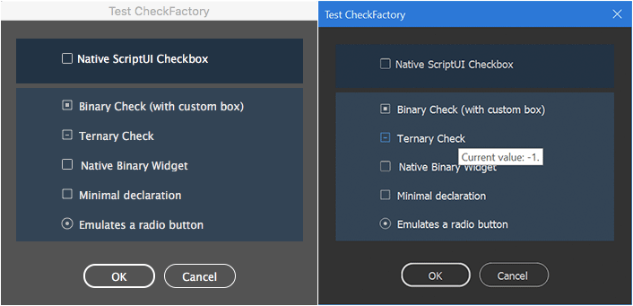
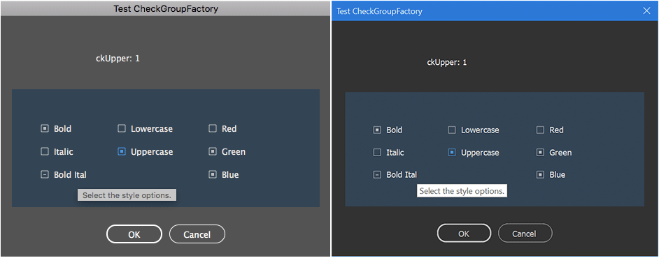

# 📚 IdExtenso Test Scripts
## Samples, Snippets, and HowTos

> **Notice**: The `/tests` subdirectory is not part of ***IdExtenso***'s core distribution. It provides basic examples and case studies for newcomers to get started with the framework.

### 🚀 Getting Started

From this location, any `.jsx` script can include the core framework using:
```javascript
#include '../$$.jsxinc'
```

Extra modules (which always belong to `/etc`) are selectively added using:
```javascript
#include '../etc/<ModuleName>.jsxlib'
```
> ⚠️ **Important**: Core framework must be included *before* any extra modules.

---

## 📋 Quick Navigation

### 📑 Table of Contents

| Script | Description | Key Features |
|--------|-------------|--------------|
| [AppToJson](#apptojson) | Stringify app.properties | JSON handling, file operations |
| [BasicScriptDemo](#basicscriptdemo) | PathNodes script demo | UI, localization, settings |
| [BasicScriptMenuDemo](#basicscriptmenudemo) | Menu-enabled PathNodes | Menu extension, persistence |
| [ByteStreamDemo](#bytestreamdemo) | ByteStream class usage | Binary data handling |
| [CheckIEEE754](#checkieee754) | IEEE754 number validation | Number conversion, benchmarks |
| [CollatorTester](#collatortester) | Collator module testing | Text collation, multilingual |
| [DomTextParcelsTest](#domtextparcelstest) | TextParcels class demo | DOM manipulation, progress bars |
| [EnvSummary](#envsummary) | Environment reporting | System info, context detection |
| [GetWebImage](#getwebimage) | Web image download | HTTP requests, ScriptUI |
| [GetWebText](#getwebtext) | Web text download | HTTP/HTTPS, text processing |
| [InstantDialog](#instantdialog) | DOM dialog creation | XML dialogs, localization |
| [LevenFilterList](#levenfilterlist) | Dynamic list filtering | String algorithms, UI events |
| [MarkovShuffle](#markovshuffle) | Text scrambling | Markov chains, randomization |
| [MenuAccess](#menuaccess) | Menu component access | DOM navigation, menu paths |
| [MenuCamelCase](#menucamelcase) | Custom menu action | Menu installation, event handling |
| [PageRangeTester](#pagerangetester) | Page range parsing | Range validation, formatting |
| [ParseIntFix](#parseintfix) | parseInt bug fixes | ExtendScript patches |
| [PlaceWebImage](#placewebimage) | Web image placement | HTTP, file handling, DOM |
| [PlayWithBigInt](#playwithbigint) | Arbitrary precision math | BigInt operations, algorithms |
| [PlayWithUnit](#playwithunit) | Unit conversion | Measurement units, i18n |
| [RectPackTest](#rectpacktest) | Rectangle packing | Layout algorithms, geometry |
| [RegexFromCodeRanges](#regexfromcoderanges) | Unicode regex building | Character ranges, regex patterns |
| [ScriptUIBuilder](#scriptuibuilder) | UI construction | Component factories, widgets |
| [ScriptUIColorTester](#scriptuicolortester) | UI color testing | Color management, themes |
| [ShowEnvironment](#showenvironment) | Environment display | System diagnostics |
| [ShowHelp](#showhelp) | API documentation | Module introspection |
| [SuiFactories](#suifactories) | ScriptUI components | Custom widgets, factories |
| [UnicodeToAscii](#unicodetoascii) | Text transliteration | Unicode conversion |
| [UseJsxBlindLib](#usejsxblindlib) | Script obfuscation | Binary scrambling |
| [YaltIsGreat](#yaltisgreat) | Localization demo | Multi-language support |
| [ZDeflate_ZInflate_Test](#zdeflate_zinflate_test) | Compression testing | Data compression, validation |

---

## 🔧 Detailed Script Reference

### 📄 AppToJson

**[`AppToJson.jsx`](AppToJson.jsx)**

> Stringify the entire contents of `app.properties`.

**🎯 Demonstrates:**
- `$$.JSON.lave()` routine (just calling `$$.JSON()`, as this is the `auto` method)
- Some nice options behind it (verbose vs. compact format…)
- `$$.File.temp()` to output the result in a temp file (and open it)

---

### 🎨 BasicScriptDemo

**[`BasicScriptDemo.jsx`](BasicScriptDemo.jsx)**

> Manage a complete InDesign script (*PathNodes*) that creates custom circles at each path point of target item(s).


**🎯 Demonstrates:**
- Usage of **BasicScript** module (settings, localization, UI)
- Providing a **Yalt** package in four languages (`EN` + `FR` `DE` `ES`)
- **Settings** keys with various lifespans (`RESET`, `SESSION`, `APP`)

---

### 🍴 BasicScriptMenuDemo

**[`BasicScriptMenuDemo.jsx`](BasicScriptMenuDemo.jsx)**

> With just a few additional lines, the previous script "PathNodes" is extended into a BasicScriptMenu, that is, a `BasicScript` component with a `MenuExtension`.


**🎯 Demonstrates:**
- Usage of **BasicScriptMenu** module (settings, localization, UI + MenuExtension)
- Providing a **Yalt** package in four languages (`EN` + `FR` `DE` `ES`)
- **Settings** keys with various lifespans (`RESET`, `SESSION`, `APP`)

---

### 📊 ByteStreamDemo

**[`ByteStreamDemo.jsx`](ByteStreamDemo.jsx)**

> Getting started with the `$$.ByteStream` class.

**🎯 Demonstrates:**
- **ByteStream** constructor (both modes)
- I/O methods and various tests with number and string tags

---

### 🔢 CheckIEEE754

**[`CheckIEEE754.jsx`](CheckIEEE754.jsx)**

> Perform tests on `Number.fromIEEE754()` and `Number.prototype.toIEEE754()` functions. This script generates 10,000 random numbers in IEEE754 64bit format and check whether the dedicated routines properly handle them. We used it to benchmark and validate the implementation of `fromIEEE754()` and `toIEEE754()`. Cool thing is, the script double-checks each conversion throughout the `TransformationMatrix` object, which provides a hidden way to encode a Number instance into IEEE754 form. See the code for details.


**🎯 Demonstrates:**
- Using `Number.fromIEEE754(hex)` and `Number.prototype.toIEEE754()`
- Getting IEEE754 representation from `TransformationMatrix`'s name property (personal hack)
- Using the `Random` class to generate random numbers

---

### 🌍 CollatorTester

**[`CollatorTester.jsx`](CollatorTester.jsx)**

> Experiment IdExtenso's ***Collator*** module in various languages.


**🎯 Demonstrates:**
- Using the `Collator` module
- Adding a custom ***YALT*** package (`EN` + `FR` `DE` `ES` `IT` `RU`)
- Simple modal dialog interface generated by `ScriptUI.builder`

---

### 📝 DomTextParcelsTest

**[`DomTextParcelsTest.jsx`](DomTextParcelsTest.jsx)**

> Lifts the veil on the intimidating [$$.Dom.TextParcels](../etc/$$.Dom.TextParcels.jsxlib) class.

**🎯 Demonstrates:**
- Calling the `error()` function
- Using a simple progress bar (via `$$.Progress`)
- Creating a `TextParcels` (in short _TP_) instance with default options
- Running `TP.consolidate()`, then `TP.getSamples()` handled by a custom function
- Using the Log to collect data (`Log.push`)

---

### 🖥️ EnvSummary

**[`EnvSummary.jsx`](EnvSummary.jsx) vs. [`EnvSummary.bin.jsx`](EnvSummary.bin.jsx)**

> Report scripting context from the Env module.

**🎯 Demonstrates:**
- Usage of `$$.Env.domVersion()`, alias: `$$.domVersion()`
- Usage of `$$.Env.summary()`, alias: `$$.Env()`
- Main script and Running code status (JSX vs. JSXBIN), see `EnvSummary.bin.jsx` for additional information
- Log in TRACE mode

---

### 🖼️ GetWebImage

**[`GetWebImage.jsx`](GetWebImage.jsx)**

> Download a PNG through `http` and load it in a ScriptUI dialog.   
> _The user can now click the image to open the URL in the navigator!_


**🎯 Demonstrates:**
- `$$.Web(url)`, shortcut of `$$.Web.get(url)`
- Using `toSource()` with binary strings is more compact w/ IdExtenso
- Tracing steps thru `$$.trace()`, and more details on Log levels
- [190322] Use ScriptUI.builder(); call `$$.Web.browse()` on click

---

### 📄 GetWebText

**[`GetWebText.jsx`](GetWebText.jsx)**

> Download a text through `http(s)`. Result is shown either in the active selection (if any) or in trace console.

**🎯 Demonstrates:**
- `$$.Web(url, 1)` with `wantText` option turned on

---

### ⚡ InstantDialog

**[`InstantDialog.jsx`](InstantDialog.jsx)**

> InDesign DOM dialog fast, easy, and with automatic localization.


**🎯 Demonstrates:**
- Usage of `$$.Dom.Dialog.fromXML()`
- Displaying the dialog and having strings localized through **Yalt**
- Access to UI values using `Dialog.setValueKey()` and `Dialog.getValueKey()` (augmented prototype)
- Using `$$.isBooting()` to prepend persistent data (makes sense when a `#targetengine` directive is in use)

---

### 🔍 LevenFilterList

**[`LevenFilterList.jsx`](LevenFilterList.jsx)**

> Dynamic listbox filter based on [Levenshteim distance](https://en.wikipedia.org/wiki/Levenshtein_distance).


**🎯 Demonstrates:**
- Using `String.levenFilter()`
- Using `ScriptUI.builder()` with event handlers

---

### 🎲 MarkovShuffle

**[`MarkovShuffle.jsx`](MarkovShuffle.jsx)**

> Text scrambler based on Markov chains.

**🎯 Demonstrates:**
- Using the **Markov** module for the purpose of scrambling texts in InDesign
- Including the **Random** module (to improve random functions)

📖 Cf. [Full article and demo](http://www.indiscripts.com/post/2018/01/how-to-shuffle-characters-the-right-way)

---

### 🍔 MenuAccess

**[`MenuAccess.jsx`](MenuAccess.jsx)**

> Accessing existing menu components (menus, submenus, or menuitems).

**🎯 Demonstrates:**
- Testing the **Dom.Menu.get()** routine on various paths like `[ 0, '', '$ID/EditMenu_FindChange' ]`, `[ '$ID/Main', 0, '$ID/Open...' ]`, etc.

---

### 🐫 MenuCamelCase

**[`MenuCamelCase.jsx`](MenuCamelCase.jsx)**

> Full example of installing a custom "Change Case > CamelCase" menu action.


**🎯 Demonstrates:**
- Using advanced **Dom.Menu** features
- Dealing with engine-persistent script and processing DOM events accordingly via `$$.globalEvent()`
- Declaring a custom module using the `eval(__(MODULE, $$, ...))` macro-syntax

---

### 📖 PageRangeTester

**[`PageRangeTester.jsx`](PageRangeTester.jsx)**

> Parse, format and normalize page ranges.


**🎯 Demonstrates:**
- Inclusion and usage of `$$.PageRange`
- Simple modal dialog interface generated by `ScriptUI.builder`

---

### 🔧 ParseIntFix

**[`ParseIntFix.jsx`](ParseIntFix.jsx)**

> Run some tests on `$.global.parseInt` once patched by IdExtenso. (More detail [here](http://indiscripts.com/post/2019/01/how-to-get-parseint-fixed-in-extendscript).)


**🎯 Demonstrates:**
- Fixing a native ExtendScript bug in the `[[global]]` scope
- Using `$$.trace`

---

### 🌐 PlaceWebImage

**[`PlaceWebImage.jsx`](PlaceWebImage.jsx)**

> Download an image through `http` and place it in the active spread. (This script is a variant of GetWebImage.)

**🎯 Demonstrates:**
- `$$.Web(url)`, shortcut of `$$.Web.get(url)`
- Using `$$.Web.parseURI` to identify the parts of an URL
- Using `$$.File.temp` to create a temporary file

---

### 🔢 PlayWithBigInt

**[`PlayWithBigInt.jsx`](PlayWithBigInt.jsx)**

> Compute (arbitrary-precision) _big integers_ using the **BigInt** module.

**🎯 Demonstrates:**
- Including an optional module (from `/etc`)
- Various ways of declaring `BigInt` instances
- Using operators: `==`, `<`, `<=`, `+`, `-`, `*`, `/`, `%`, `<<`, `>>`, `~`, `&`, `|`, `^`
- Divide-and-Remainder method, primality
- Finding a huge prime number

---

### 📏 PlayWithUnit

**[`PlayWithUnit.jsx`](PlayWithUnit.jsx)**

> Use a consistent facade for handling metrical units.


**🎯 Demonstrates:**
- Optional module inclusion
- Usage of `$$.Dom.Dialog()`
- Basic internationalization (decimal point, etc.)
- Experimenting the Unit API: `info()`, `parse()`, `convertNumber()`, `format()`

---

### 📦 RectPackTest

**[`RectPackTest.jsx`](RectPackTest.jsx)**

> Simple rectangle packing (without rotation) on the active spread. (Undoable.)


**🎯 Demonstrates:**
- Using the `RectPack` module (`etc` branch)
- Invoking the `error()` function

---

### 📝 RegexFromCodeRanges

**[`RegexFromCodeRanges.jsx`](RegexFromCodeRanges.jsx)**

> A useful static routine available in the `RegExp` object.

**🎯 Demonstrates:**
- Converting a set of code ranges into a RegExp pattern
- Limitations (surrogate pairs must be consistent, i.e share the same base)
- Producing a regex that captures misc. symbols and pictographs (from U+1F300 to U+1F5FF)

---

### 🏗️ ScriptUIBuilder

**[`ScriptUIBuilder.jsx`](ScriptUIBuilder.jsx)**

> Build a powerful ScriptUI interface with no effort.


**🎯 Demonstrates:**
- Using the static `ScriptUI.builder()` function
- Example of a 'resource object' with various widgets
- Implementing a custom component thru a 'factory'

---

### 🎨 ScriptUIColorTester

**[`ScriptUIColorTester.jsx`](ScriptUIColorTester.jsx)**

> Test the ScriptUI/colors snippet.


**🎯 Demonstrates:**
- Creation of random background colors
- Color assignment via `0xRRGGBB` (hex) or `X|Y` descriptors (normal and disabled state)
- Retrieving a color descriptor from `ScriptUI.colorGetter`
- Usage of `ScriptUI.builder()` with color keys

---

### 💻 ShowEnvironment

**[`ShowEnvironment.jsx`](ShowEnvironment.jsx)**

> Simply displays the `$$.Env.summary()` string in a box. This (minimal) test script can be executed in various locales, versions, systems and contexts to illustrate the many informations the `$$.Env` module can handle.

**📱 Platform Examples:**

**Example 1:** The script is in JSXBIN form and executed in macOS 10.13 / InDesign CC 15.1 (dark UI) for the 4th time (`run #4`) in the 'main' engine (non-persistent). DOM version in-sync with InDesign version (15.1), user is _admin_, locale is FRENCH/fr_FR:


**Example 2:** The script is in regular JSX form and executed in Windows 10/64 from InDesign CC 16.1 (dark UI) for the 1st time (`run #1`) in a persistent ('myScript') engine. Furthermore, it is executed as a _startup script_ now (feature available from IdExtenso 2.10403). DOM version in-sync with InDesign version (15.1), user is _Moi_, locale is ENGLISH/en_US:


**🎯 Demonstrates:**
- `$$.Env()` — alias of `$$.Env.summary()`

---

### ❓ ShowHelp

**[`ShowHelp.jsx`](ShowHelp.jsx)**

> Get help on core and included modules.


**🎯 Demonstrates:**
- `$$.help()`; this method scans all present modules and displays the resulting API in a modal dialog

---

### 🎛️ SuiFactories

**ScriptUI Component Factory Demos**

> This subfolder provides basic demo scripts showing the behaviors and features of custom ScriptUI components available in [etc/ScriptUI/factories](/etc/ScriptUI/factories):

#### 🔘 Check Components
- **[`TestCheck.jsx`](SuiFactories/TestCheck.jsx)** — Various `Check(Factory)` components (custom checkboxes)
  
  

- **[`TestCheckGroup.jsx`](SuiFactories/TestCheckGroup.jsx)** — `CheckGroup(Factory)` (consistent set of checkboxes)
  
  

- **[`TestCheckList.jsx`](SuiFactories/TestCheckList.jsx)** — `CheckList(Factory)` (hierarchical checklist) + `Popup`
  
  

- **[`TestDrawnCheck.jsx`](SuiFactories/TestDrawnCheck.jsx)** — Various `DrawnCheck(Factory)` icons
  
  

#### 🎨 Color & Input Components  
- **[`TestColorPalette.jsx`](SuiFactories/TestColorPalette.jsx)** — `ColorPalette(Factory)` (hidden palette in stack container)
  
  

- **[`TestEditAndStepper.jsx`](SuiFactories/TestEditAndStepper.jsx)** — `Edit(Factory)`, `EditInteger(Factory)` and `Stepper(Factory)` components
  
  

#### 💬 Interactive Components
- **[`TestPopup.jsx`](SuiFactories/TestPopup.jsx)** — `Popup(Factory)` component with mouse-over messages
  
  

- **[`TestSideMenu.jsx`](SuiFactories/TestSideMenu.jsx)** — `SideMenu(Factory)` component + `Popup`
  
  

---

### 🌍 UnicodeToAscii

**[`UnicodeToAscii.jsx`](UnicodeToAscii.jsx)**

> Basic Unicode-to-ASCII transliteration.

**🎯 Demonstrates:**
- Including and using the `$$.UniAsc` module
- Live-testing the `translit()` method from a ScriptUI dialog made up from `ScriptUI.builder()`

---

### 🔒 UseJsxBlindLib

**[`UseJsxBlindLib.jsx`](UseJsxBlindLib.jsx)**

> Scramble a jsxbin file choosen by the user.

**🎯 Demonstrates:**
- Including and invoking the new ***JsxBlindLib*** library from any script project

---

### 🗣️ YaltIsGreat

**[`YaltIsGreat.jsx`](YaltIsGreat.jsx)**

> Basic features of the localization module (**Yalt**).

**🎯 Demonstrates:**
- Including an optional module (from `/etc`)
- Adding a localization package of your own
- Using the `__()` function with a Yalt string
- Activating another locale
- Inserting a placeholder in a translation string

---

### 🗜️ ZDeflate_ZInflate_Test

**[`ZDeflate_ZInflate_Test.jsx`](tests/ZDeflate_ZInflate_Test.jsx)**

> Comprehensive testing of the compression and decompression modules (**ZDeflate** and **ZInflate**).

**🎯 Demonstrates:**
- Including compression modules from `/etc` (ZDeflate and ZInflate)
- Testing both raw deflate and RFC 1950 zlib formats
- Comprehensive data validation with multiple test cases (empty strings, simple text, repetitive data, binary data)
- Performance benchmarking with timing measurements
- Error handling and test result reporting
- Using compression ratio calculations and utility methods

---

## 🚀 Getting Started Guide

1. **Choose a script** from the table above based on your needs
2. **Navigate directly** using the anchor links 
3. **Read the description** and examine the demonstrations
4. **Run the script** in Adobe InDesign to see it in action
5. **Study the code** to understand the implementation

> 💡 **Tip**: Start with simpler scripts like `AppToJson` or `ShowEnvironment` before moving to complex ones like `MenuCamelCase` or `ZDeflate_ZInflate_Test`.

---

*Happy scripting with **IdExtenso**! 🎉*
