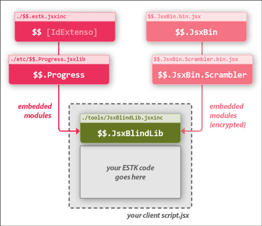
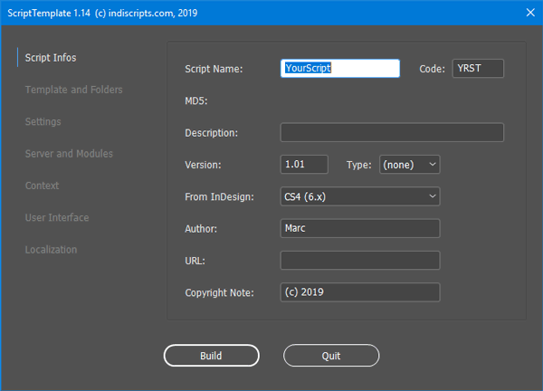
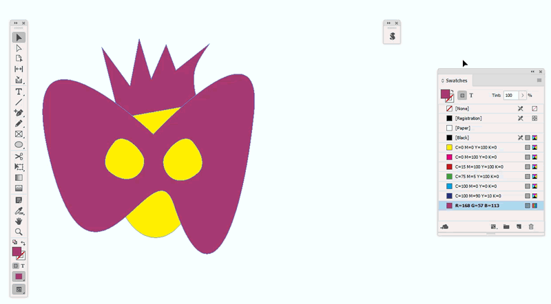

## Dev Tools

### Overview

The `/tools` subdir is not part of ***IdExtenso***'s core distribution. It offers to developers additional gems and scripts that make coding more productive.

From this location, any `.jsx` script can include the core framework using `#include '../$$.jsxinc`. As usual, extra modules—which always belong to `/etc`—may be selectively added using `#include '../etc/<ModuleName>.jsxlib`.

### List of Tools

* GetMD5
* JsxBlindLib
* RebuildCollator
* RebuildUnicode
* ScriptTemplate
* SDB-to-IDEX
* SelToPng

### Detail

##### [`GetMD5.jsx`](GetMD5.jsx)

Compute and prompt the MD5 hash of the input string. (Based on `etc/$$.MD5.jsxlib`.)

---

##### [`JsxBlindLib.jsxinc`](JsxBlindLib.jsxinc)

***JsxBlind 2.1 Library*** for ExtendScript Toolkit. A full, smart, and fast `jsxbin` obfuscator.

_How to use it?_ Give a look at the sample code [`UseJsxBlindLib.jsx`](../tests/UseJsxBlindLib.jsx) in the `/tests` directory.

  - Version 2.1 (Feb 4, 2019) fixes two critical bugs regarding reserved words.

**Documentation:**

1. The file `./tools/JsxBlindLib.jsxinc` is an “IdExtenso library”, that is, a regular _module_ which invokes `$$.load()`. Therefore you just have to `#include` that library at the beginning of your project and its API is instantly loaded and ready to use.

		#include path/to/tools/JsxBlindLib.jsxinc
		
		// Your ESTK code goes here, e.g:
		var result = $$.JsxBlindLib(myBinFile, myOptions);
		// etc

2. Alternately, if you need to keep your project independent from IdExtenso's source files, use the “includable JSXBIN image” `JsxBlindLib.bin.jsx`. It provides a fully compiled version of the library with all nested dependencies. Then you can put it anywhere and use:

		#include my/own/path/to/JsxBlindLib.bin.jsx
		
		// Your ESTK code goes here, e.g:
		var result = $$.JsxBlindLib(myBinFile, myOptions);
		// etc

_Note._ The only difference between option 1. and option 2. is, the former still belongs to IdExtenso's directory structure and keeps up-to-date when something changes in the framework. By contrast, option 2. is detached from any change in the framework: it reflects the API at a particular time.

3. In either case, including the library makes available the root object `$$`, its core modules (`$$.JSON`, `$$.Log`, etc) and two important modules: `$$.Progress` and `$$.JsxBlindLib`.

* [`$$.Progress`](/etc/$$.Progress.jsxlib) just provides the API of a basic progress bar. It is required if you tell JsxBlind to show the progression of its process.

* [`$$.JsxBlindLib`](/tools/JsxBlindLib.jsxinc) implements the specific API of the library, which itself relies on two encrypted modules (`$$.JsxBin` and `$$.JsxBin.Scrambler`) that you don't have to worry about.

4. The function `$$.JsxBlindLib.run(input, options)` — or simply `$$.JsxBlindLib(input, options)` — will “scramble” the symbols of the JSXBIN input without altering the underlying program. It has two optional arguments:

* _input_ (`String` or `File`): JSXBIN input data. If not supplied, the user is asked to choose a file. The _input_ content basically looks like _@JSXBIN@ES@2.0@MyBbyBn0Ah..._ (raw form.) The library supports “eval string” as well, where data are formatted `eval("@JSXBIN@ES@2.0@MyBbyBn0Ah...")` as seen in many JSX projects. Note that leading and/or trailing instructions that may _wrap_ the JSXBIN content are properly recognized:

		#targetengine "MyGreatScript"

		// Below is the actual JSXBIN content.
		eval("@JSXBIN@ES@2.0@MyBbyBn0Ah...");

		// End of the input file.
		alert("ok");

* _options_ (`Object`): A set of preferences in `{ key:val, ... }` form. The supported options, all optional, are detailed below:

		folder        (Folder or String) Preferred I/O folder in case no valid
		              input argument is provided. If this option is missing or
		              invalid, use the Desktop folder.
		
		hitFuncNames  (Boolean) Whether function names must be treated as mutable
		              identifiers instead of immutable tokens. Default is FALSE,
		              meaning that all function names must be preserved.

		whiteList     (RegExp) Unless reserved, any symbol that matches this regular
		              expression will be regarded as mutable (whatever its context.)
		              By default, no whitelist is created. [Use with great caution!]

		blackList     (RegExp) Unless white-listed, any symbol that matches this
		              regular expression will be regarded as immutable, i.e, the
		              scrambler will keep it unchanged. By default, no blacklist is
		              created.

		progress      (1 or Function) If supplied, callback function invoked during
		              the process. The `progress` function is assumed to support two
		              arguments, `percent` (unsigned int) and `message` (string), in
		              that order. At regular time intervals, the scanner calls the
		              progress function with `percent` set to the current scanning
		              location coerced into an integral percentage, and `message` set
		              to the string: "Scanning JSXBIN: <location>/<length>."
		              Set `progress` to 1 to use the $$.Progress module. By default,
		              no progress function is invoked.

		frequency     (1..10) Reflects the rate at which the `progress` function, if
		              available, is called. Use a high frequency to make your progress
		              bar very responsive. Use a low frequency to make it react slowly.
		              The default `frequency` is 5.

		report        (Boolean) Tells the `run` function to create a list of altered
		              symbols. -> See `$$.JsxBinLib.getReport()` below
		              By default, no report is created, which speeds up the process.

		noWrapper     (Boolean) If TRUE, does not care of leading/trailing instructions
		              of the `input` stream and strictly returns the JSXBIN string. By
		              default, both prolog and epilog parts are restored in the output.
		              You may turn on `noWrapper`, for example, if the JSXBIN result is
		              to be post-processed from your script, re-injected into a custom
		              template, etc.

5. The `JsxBlindLib` module offers three additional static methods:

* `getTiming()`: returns the whole duration (_uint_) of the last `run()` execution, in milliseconds.

* `getInputURI()`: returns the URI (_string_) of the input file, if a file was supplied; otherwise returns the empty string.

* `getReport()`: provided the `report` option was turned on, returns an `Object` that reflects how symbols have been altered during the last `run()` execution. The report object is structured as follows:

		{
		count:        (uint) Total number of altered identifiers (changed+swapped.)

		changes:      (Array) Changed symbols. Array of strings of the form
		                 `"OrigSymb" ===> [Code]`
		              where OrigSymb denotes the original symbol before scrambling
		              and Code denotes the final JSXBIN encoding of that symbol.

		swaps:        (Array) Permuted symbols. Array of strings of the form
		                 `"OrigSymb" ===> "FinalSymb"`
		              where OrigSymb denotes the original symbol before permutation
		              and FinalSymb the symbol finally used.
		}

_Note._ When no better option is available, the scrambler performs _swaps_ rather than _changes_. This typically happens with short symbols of one or two characters that have a tiny range of _exotic_ substitutions. For example, the identifier `x` cannot be changed into say `隰` due to encoding constraints. But it can be exchanged with another symbol used in the program, e.g `y` or `p`, which still contributes in obfuscating the code.

---

##### [`RebuildCollator.jsx`](RebuildCollator.jsx)

Selectively reconstruct the resources of the [Collator](/etc/$$.Collator.jsxlib) module using [MetaCollator](/etc/$$.MetaCollator.jsxlib).

---

##### [`RebuildUnicode.jsx`](RebuildUnicode.jsx)

Reconstruct the resources of the [Unicode](/etc/$$.Unicode.jsxlib) module using [MetaUnicode](/etc/$$.MetaUnicode.jsxlib).

---

##### [`ScriptTemplate`](ScriptTemplate.jsx)

***ScriptTemplate*** for InDesign/IdExtenso is a complete tool for building advanced scripts based on either DOM or ScriptUI dialog (BasicScript vs. ModalScript modules.) You can easily specify the attributes of your project in the GUI: name, description, extra modules, YALT locales, context, server, UI components, etc. No need to manually create the underlying files and to write their dependencies.

**Demo:** _(Click the image to run the video)_

  - Version 1.14 (March 31, 2019) is the first public release. It is localized in English and French.

_Trivia: ScriptTemplate.jsx is itself entirely based on the ModalScript module. It purely emanates from a Context/UI/Server template. All parameters are managed through $$.Settings and automatically linked to custom ScriptUI components (ScriptUI.builder). French localization is powered by $$.YALT. In other words, ScriptTemplate's template can be generated by ScriptTemplate ;-)_

---

##### [`SDB-to-IDEX.jsx`](SDB-to-IDEX.jsx)

Translates [ScriptUI Dialog Builder](https://scriptui.joonas.me) JSON bundle into a `ScriptUI.builder` resource object.

• More on SDB here: https://github.com/joonaspaakko/ScriptUI-Dialog-Builder-Joonas

• Online tool: https://scriptui.joonas.me

---

##### [`SelToPng.jsx`](SelToPng.jsx)

Convert the current selection (`PageItem`, `Group` etc.) into a serialized PNG string and show the result in a dialog. You can then copy-paste the PNG string and use it to build a ScriptUI image straight in your code without the need of deploying a file.
